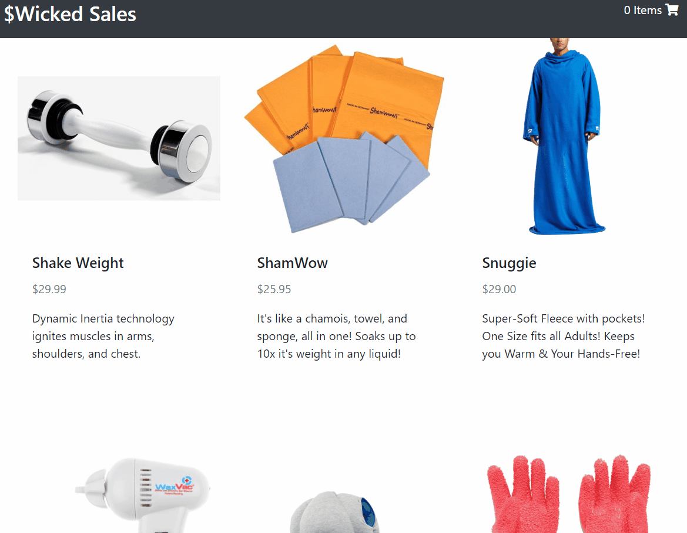

# wicked-sales-js
A full stack Node.js and React shopping cart app.

## Live Demo

Try the application live on [my portfolio](https://shopping.judyichiang.com/)

## Features
- User can view the products for sale
- User can view details of a product
- User can add a product to their cart
- User can add a product to their cart
- User can view their cart summary
- User can place an order
- Mobile Responsiveness

## Preview



## System Requirements

- Node.js 10 or higher
- NPM 6 or higher
- PostgreSQL 6 or higher

#### Getting Started

1. Clone the repository.

```shell
git clone https://github.com/judyichiang/wicked-sales-js.git
```

2. Change directory to cloned folder
```shell
cd wicked-sales-js/
```

3. Install all dependencies with NPM.
```shell
npm install
```

4. Start PostgreSQL server
```shell
sudo service postgresql start
```

5. Create the database
```shell
createdb wickedSales
```

6. Import the example database to PostgreSQL
```shell
npm db:import
```

7. Access the wickedSales Postgresql database server using pgweb in your default web browser
```shell
pgweb --db=wickedSales
```

8. Start the project.

```shell
npm run dev
```

9. Once started, you can view the application by opening [https://localhost:3000](https://localhost:3000)
